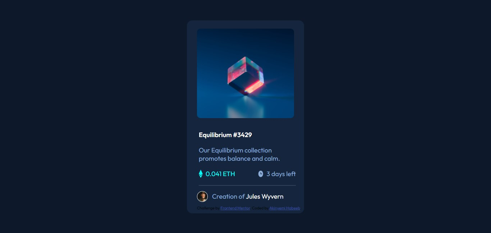

# Frontend Mentor - NFT preview card component solution

This is a solution to the [NFT preview card component challenge on Frontend Mentor](https://www.frontendmentor.io/challenges/nft-preview-card-component-SbdUL_w0U). Frontend Mentor challenges help you improve your coding skills by building realistic projects. 

## Table of contents

- [Overview](#overview)
  - [The challenge](#the-challenge)
  - [Screenshot](#screenshot)
  - [Links](#links)
- [My process](#my-process)
  - [Built with](#built-with)
  - [What I learned](#what-i-learned)
  - [Continued development](#continued-development)
  - [Useful resources](#useful-resources)

## Overview
- This is a project to replicate a NFT preview card component.It requires basic web development skills such as HTML & CSS

### The challenge

Users should be able to:

- View the optimal layout depending on their device's screen size
- See hover states for interactive elements

### Screenshot

### Links

- Solution URL: [Solution URL](https://github.com/Akinyemi4/NFT-PREVIEW-CARD-COMPONENT)
- Live Site URL: [Live site URL](https://akinyemi4.github.io/NFT-PREVIEW-CARD-COMPONENT/)

## My process
I start most of my solutions sequentially starting from HTML section then the CSS part to get a beginning structure after which I adjust somethings moving from one section to the other.

### Built with

- Semantic HTML5 markup
- CSS custom properties
- Flexbox

### What I learned
- Better understanding of flexbox
- How to add an icon with the img attributes
- HTML element to add a line
- How to design texts within the same elements differently using the element 'span'
- How to design a circled border

### Continued development
- I would love to work more on my alignment skills
- Ability to solve complex problems within short duration
- Simplicity in my codes 

### Useful resources

- [SHAPES](https://css-tricks.com/the-shapes-of-css/) 
- This helped me understand how to add shapes to border.
- [STACK OVERFLOW](https://stackoverflow.com/) 
- This is an amazing website that i used to get solutions on web development.
